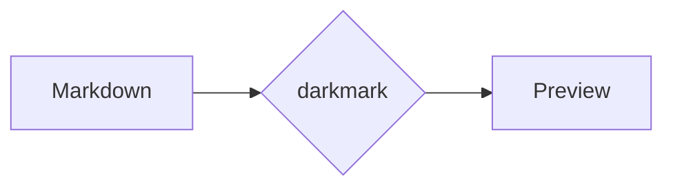

# darkmark v2 fixture

Open this in VS Code with darkmark to check every v2 feature by hand.

## Images

Relative to parent: 

Subfolder with a space in the name: 

Raw HTML: 

Remote: 

## Video and audio

Markdown syntax: 

Raw HTML:

<video controls width="320"><source src="assets/clip.webm" type="video/webm"></video>

Audio: 

YouTube:

<iframe width="420" height="236" src="https://www.youtube-nocookie.com/embed/dQw4w9WgXcQ" allowfullscreen></iframe>

## Task list

- [ ] todo
- [x] done
- plain item

## Math

Inline $x_1^2 + y_1^2 = r^2$ and a block:

$$
\int_0^\infty e^{-x^2}\,dx = \frac{\sqrt{\pi}}{2}
$$

## Mermaid



## Code

```ts
const answer: number = 42; // hover → Copy
```

## Links

- [Jump to Math](#math)
- [Duplicate heading](#links-1)
- [Other markdown file](./other.md)
- [Non-markdown file](../package.json)
- [Website](https://github.com/n1th1n-19/DARKMARK)

## Links

Second "Links" heading → id `links-1`.
